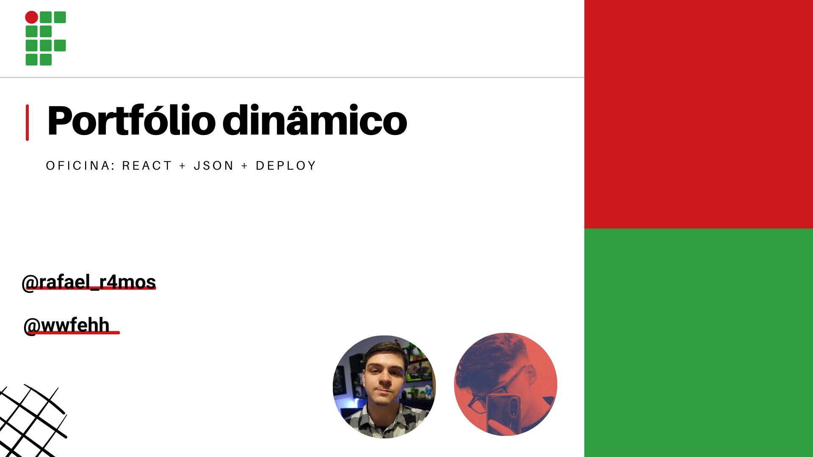

# Portfólio dinâmico com react

por: `Rafael Ramos` e `Felipe Scheffer`

Seja bem-vindo a oficina construindo um Portfólio dinâmico com react.

## Sumário

- [Instalações](#instalações)
- [Recuperando o Projeto](#-recuperando-o-projeto)
- [Deixando o projeto com sua cara](#-deixando-o-projeto-com-a-sua-cara)
- [Deploy do Projeto](#-fazendo-o-deploy-do-projeto)



## Para utilizar o projeto

### Instalações

Caso não tenha estas 2 ferramentas instale:

- **Instale o VSCode** -> [vsCodeLink](https://code.visualstudio.com/).
  Escolha o instalador do seu sistema operacional e siga o processo de instalação

- **Instale o NODE** -> [siteNode](https://nodejs.org/en). Baixe a **versão LTS** do instalador do seu sistema operacional.

---

### 💹 Recuperando o projeto

- 📂Via zip

1.  Clique no botão verde "code" e faça download como ZIP do projeto.

2.  Extraia o zip do projeto

3.  Abra o VSCode > clique em "arquivo" > abrir pasta > procure a pasta do projeto extraída.

4.  Após abrir o projeto no VSCode, abra o terminal

5.  Rode o comando:

```node
npm i
```

6. Se não retornar nenhum erro, rode o comando abaixo para executar o projeto.

```
npm run dev

//clique no link gerado como "localhost"
```

---

### 🎨 Deixando o projeto com a sua cara

1. Acesse o arquivo **theme.css** em: `styles > theme.css`. Você encontrará algo assim:

```css
:root {
  --text: #130b23;
  --background: #f9f8fc;

  --primary: #2d1b50;
  --secondary: #eae4f6;
  --accent: #754bc3;

  --white: #ffffff;
  --black: #000000;
}
```

2. Mude as cores para as de sua preferência. Você pode usar o site: **[Realtime colors](https://www.realtimecolors.com/?colors=000000-ffffff-8fb4ff-ebf1ff-ff8f94&fonts=Poppins-Poppins)** para definir a sua paleta de cores.

3. Acesse o arquivo **db.json** em: `public > db.json`. Você encontrará algo assim:

```json
{
  "userData": {
    "name": "<seu nome>",
    "occupation": "<sua ocupação>",
    "shortDescription": "<sua descrição>",
    "email": "seuemail@email.com",
    "projects": []
    ///...
  }
}
```

4. Mude as informações neste arquivo seguindo o formato e adicionando as suas informações. Acompanhe em tela para ver se está renderizando corretamente.

```json
//Exemplo:

  "userData": {
    "name": "Rafael Ramos",
    "occupation": "Front-end developer and instructor",
    "shortDescription": "Minha descrição",
    "email": "rafael@email.com",
    "projects": []
  }
```

5. Para adicionar o seu currículo, arraste o arquivo .pdf com nome **curriculo.pdf** para a pasta `public > assets > curriculo`.

> Pronto! Agora o portfólio está com a sua cara.

---

### ⚙ Fazendo o deploy do projeto

Agora só falta colocar o seu projeto no ar para gerar um link.

Vamos utilizar o **Vercel** para isso, mas primeiro **Suba o seu projeto, agora com a sua cara, para um repositório do github.**

1. Acesse o site: [Vercel](https://vercel.com/)

2. Crie uma conta e linke **com a sua do Github**

3. Após isso, vá para o dashboard e clique no botão **"Add New" > Project**.

4. Selecione o repositório do seu portfólio

5. Se quiser, altere o nome do projeto e, em seguida, **clique em "Deploy"**.

6. Aguarde completar o processo de build do projeto.

7. Após finalizado o processo você pode conferir o seu portfólio e **compartilhar o link com qualquer um!** 🤩
